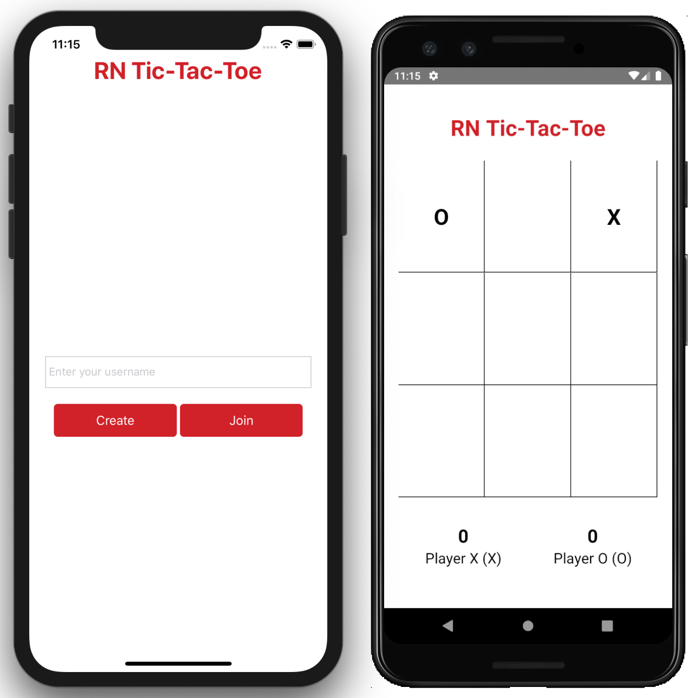

# Tic-Tac-Toe Live: real-time multiplayer (React Native + PubNub)

**Play it: https://iamsrkg.github.io/tic-tac-toe/** (open it on two devices or in two tabs)

Two players on different devices play the same board in real time. One creates a room and shares the 5-character code, and the other joins. Moves, rematches and "the other player left" all travel over **PubNub pub/sub**. It's one codebase for **Android, iOS and the web**.



## How it works

Each room is its own PubNub channel (`iamsrkg-tictactoe.<CODE>`). The protocol is 5 messages:

| Message | Sent by | Meaning |
|---|---|---|
| `{ type: 'join', name }` | guest | "I'm here." |
| `{ type: 'start', x, o }` | host | Names confirmed, round starts (the host plays X) |
| `{ type: 'move', index, piece }` | either | A move. The receiver re-validates it before applying it. |
| `{ type: 'reset' }` / `{ type: 'end' }` | host | Rematch, or close the room |

- **Presence** tells players about the room: joining checks `hereNow` (0 = no such room, 1 = host waiting, 2 = full), and a `leave` or `timeout` event tells a player their opponent left.
- **The rules are pure functions** (`src/game.js`) with unit tests: win and draw detection, turn order, legal moves and room codes. Both clients apply and validate every move with the same rules, so a stray or out-of-turn message can't corrupt the board.

## History: 2019 → 2026
It was first built in 2019 on React Native 0.59 with `pubnub-react`. In 2026 I upgraded it to **Expo SDK 57 / React Native 0.86 / React 19** and fixed 3 bugs along the way:
- **Joining never worked.** The occupancy check treated "host waiting" (1 player) as an empty room.
- **A win on the 9th move** was counted as a win *and* a draw.
- **The lobby used one global channel**, so unrelated games could interfere. Each room now has its own channel.

The Android-only prompt and native spinner were also replaced with cross-platform components, which is what made the web build possible.

## Run it
```bash
npm install
npm run web        # or: npm run android / npm run ios (Expo Go or a dev build)
npm test           # game-rule unit tests
```
It uses PubNub's public `demo` keyset by default. For your own deployment, create free keys at pubnub.com and set `EXPO_PUBLIC_PUBNUB_PUBLISH_KEY` / `EXPO_PUBLIC_PUBNUB_SUBSCRIBE_KEY`.

Every push to `master` runs the tests, exports the web build and deploys it to GitHub Pages (`.github/workflows/deploy.yml`).

## Stack
React Native 0.86 · Expo SDK 57 · React 19 · react-native-web · PubNub (pub/sub + presence) · Node test runner
